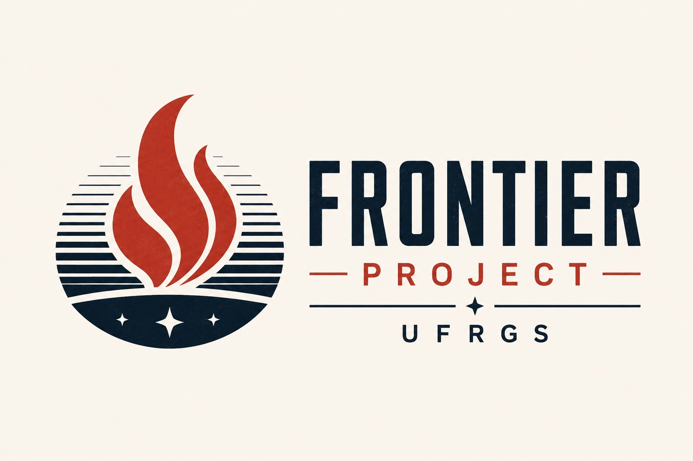

  

<h1 align="center">Frontier Project UFRGS</h1>

  <strong>Frontier Lab for Emerging Technologies</strong> 
  <em>Where physics meets the frontier of the possible.</em>

  Institute of Physics · Federal University of Rio Grande do Sul (UFRGS) 
  Porto Alegre · Brazil

---

## About

The **Frontier Project** is a frontier laboratory based at the **Institute of Physics of the Federal University of Rio Grande do Sul (UFRGS)**. It brings together, in a single space, cutting-edge research, the training of people, and the development of high-impact prototypes.

We operate at the intersection of **physics, engineering, computation, data science and artificial intelligence**, working from the conviction that the most interesting problems of our time are, by nature, interdisciplinary. Our purpose is to connect researchers, students, companies, startups and public institutions to transform scientific knowledge into real-world impact.

## Vision

To be the place, within UFRGS, where the future is built with our own hands — a space where scientific curiosity meets the courage to prototype, and where ideas that do not yet exist become reality.

## Mission

Create an interdisciplinary environment of excellence where students and researchers conceive, prototype and study emerging technologies — from brain–machine interfaces to artificial intelligence — generating knowledge, training people and producing concrete impact from the Institute of Physics at UFRGS.

In practice, this means:

* Turning research into working prototypes, and prototypes into impact.
* Building bridges between academia, industry and society.
* Supporting high-impact, interdisciplinary technological projects.
* Fostering collaboration across disciplines.
* Training a new generation of scientists and builders.

## Our Model

The Frontier Project combines three roles that usually live apart in the university:

* **Research lab** — organized into technology fronts that cross freely rather than into isolated silos; a method oriented toward building, testing and iterating.
* **Project accelerator** — a structured path that takes an idea from an early stage to a mature, visible prototype through mentorship, milestones and public showcases.
* **Learning community** — where training people is inseparable from producing results, open to the wider community through workshops and outreach.

These roles rest on three pillars: **Research**, **Education** and **Translation & Impact**.

## Technology Fronts

Projects are organized around eight technology fronts. They are not silos — most frontier projects emerge at the crossing of two or more (a brain–machine interface, for example, mobilizes BCI, robotics, data analysis and AI at once).

* **Brain–Machine Interface (BCI)** — Decoding neural signals (EEG) to control devices and study human–machine interaction.
* **Robotics** — Design, control and integration of robotic systems, from actuators to perception.
* **Prototyping** — From idea to functional prototype in short iteration cycles.
* **Data Analysis** — Turning experimental and operational data into actionable knowledge.
* **Artificial Intelligence Systems** — Agents, language models and computer vision applied to concrete problems.
* **Prediction Systems** — Predictive modeling for physical, environmental and operational phenomena.
* **3D Printing** — Additive manufacturing for functional parts, instrumentation and experimental structures.
* **Physical Simulation** — Computational modeling and numerical methods to understand and predict physical systems.

## What We Do

* Research & Development (R&D)
* Interdisciplinary innovation projects
* Industry collaboration and co-development
* Innovation programs (Project Residency, Demo Day)
* Educational initiatives and workshops
* Technology transfer and translation
* Open science projects

## Core Principles

* **Radical interdisciplinarity** — Real problems don't respect disciplinary boundaries; neither do we.
* **Build to understand** — Prototypes and experiments are legitimate, powerful ways to produce knowledge.
* **Human-centered technology** — We pursue technologies that expand human capabilities and deliver social benefit.
* **Openness & reproducibility** — Clear documentation, open methods and science others can reproduce and extend.
* **People first** — Every project is also an opportunity for the growth of those who carry it out.

## Programs

* **Fellowships & Scholarships** — for dedicated students and researchers.
* **Workshops & Training** — practical training in AI, data, prototyping, BCI and numerical methods, open to the UFRGS community and beyond.
* **Demo Day** — a semestral showcase for the community, partners and potential funders.
* **Industry Partnerships** — real challenges, co-development and access to talent and prototypes.

## Partners & Ecosystem

The Frontier Project actively seeks collaboration with:

* Companies and startups
* Research institutes and academic groups
* Government and funding agencies (CNPq, FAPERGS, CAPES)
* Innovation ecosystems
* International universities

## Get Involved

We welcome researchers, students, entrepreneurs and organizations interested in shaping the future through science and technology. Whether you want to join a front, propose a project, run a workshop or explore a partnership — let's talk.

📍 **Building 43132 · Room 109C · Campus do Vale**
Av. Bento Gonçalves, 9500 · Agronomia · Porto Alegre/RS · 91509-900 · Brazil

---

  <strong>Frontier Project UFRGS</strong> 
  Science • Technology • Innovation 
  <em>"Transforming knowledge into impact."</em>

